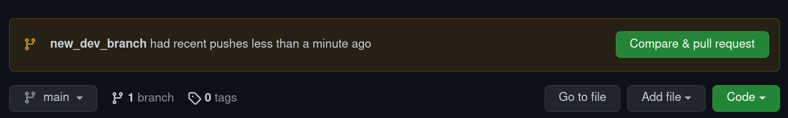

# Publishing to GitHub

For a DevOps project to be published on GitHub, it **MUST** include the components listed below. Without ALL of these components, a project cannot be published to GitHub.

-   README.md - Project documentation in Markdown format
-   LICENSE - Provided by Legal and included in all projects
-   A document of license statements / disclosures of 3rd party dependencies
-   Project Source Code

A project **Should** include the following:

-   .gitignore file
-   Linting rules
-   A "test" folder (with at least one dummy test case)
-   For node.js based projects:

    -   A 'pre-test' in the package.json that performs a test against the linting rules
    -   'test' which performs all tests in the test folder

-   CHANGELOG.md file

Wherever possible external third party references should _not_ be committed to submodules. For example, `node_modules`, `bower_components` etc. The project should employ a `package.json` or similar package management device to avoid packaging third party libraries, modules etc.

> Ensure that you do not upload secrets/keys to Github. Where needed, keep secrets in a separate file which is included in your .gitignore or in environment variables.

## GitHub Workflow

---

Github Projects should be reviewed before a change is committed. Avoid pushing to main and instead create a new branch and then a pull request. Reviewers are recommended for projects to improve code quality and to catch errors.

For information on the Github pull request workflow see the [following](https://guides.github.com/introduction/flow/).

The following illustrates the basic workflow for Github:

-   Initilize git and clone your project:

    `git init`

-   Clone your repo

    `git clone <your repo>` example: `git clone git@github.com:fortinet/github-example-repo.git`

-   Check out a new branch

    `git checkout -b new_dev_branch`

-   Add new files

    `git add .`

-   Commit your changes

    `git commit -m 'My commit message'`

-   Push your changes. This command will also create your new branch on github.

    `git push -u origin new_dev_branch`

-   Once this is done you can navigate to your Github repo and you should see the following:


      
      ```

      Select `Compare & pull request` or navigate to Pull request.

    ```

-   From here you will see the Github PR request. You should add reviewers and assign yourself to the PR.


      
   

### GitHub Releases

---

Tagged releases are recommended for projects that require github releases.
To create a new release version, tag the commit on Gerrit before it's merged:
`git tag -a 1.0.0 -m "Initial Release" && git push --tags`.
Once this commit is merged and published the tag can be used to create a release on Github.

Release tag version numbers should follow [semantic versioning](https://semver.org/#semantic-versioning-200) for consistent releases. Under this scheme, version numbers and the way they change convey meaning about the underlying code and what has been modified from one version to the next.

### GitHub Release Artifacts

Some projects may wish to build artifacts for each release. For example, the fortigate-autoscale-\* projects generate a zip file which bundles all the dependencies needed to run the cloud functions included in the project:

-   Deployment release artifacts can be created/run with [GitHub Actions](https://github.com/features/actions).
-   Projects should trigger release builds [for each new tag](https://docs.github.com/en/actions/reference/workflow-syntax-for-github-actions#onpushpull_requestbranchestags)
-   Example workflows can be found [here](https://github.com/fortinet/fortigate-autoscale/blob/3.1.2/.github/workflows/auto-release-pipeline.yml) and [here](https://github.com/fortinet/fortigate-autoscale-aws/blob/3.2.1/.github/workflows/publish-releases.yml)

> Pre-compiled executable artifacts will not be accepted for publishing to Fortinet's GitHub repositories.

## Reporting Bugs

Bugs can be reported on the repo Issues tab; internal issues and general issues should be reported on Mantis using the **DevOps** project.

## Styleguide

### External references
